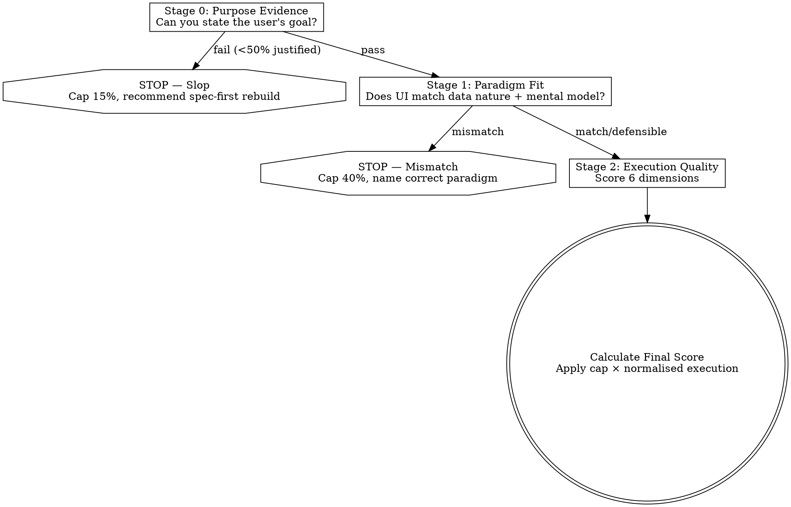

# UX Fitness Assessment

## Overview

**Assess whether a UI is the ideal paradigm for the task, then score how well it executes that paradigm.**

Most UX problems aren't poor execution — they're the wrong UI type entirely. A beautifully polished table displaying graph data is still the wrong UI. This skill catches paradigm mismatches first, then evaluates execution quality.

**Not for:** Accessibility audits, visual/aesthetic assessment, performance, or design system compliance.

## When to Use

- After a UI is designed or implemented, as a fitness check
- When reviewing whether an existing page is the right *shape* for its task
- When something feels off but you can't articulate why
- When comparing alternative UI approaches for a feature
- When a UI feels overbuilt, wrong, cluttered, or "not quite right"
- When a page works but users avoid it or find workarounds
- When AI-generated UI looks polished but feels purposeless (slop detection)

## Quick Reference

```
STAGE 0: Can you state the user's goal? → No = Slop (cap 15%)
STAGE 1: Does paradigm match data nature? → Mismatch = cap 40%, Defensible = cap 75%
STAGE 2: Score 6 dimensions (1-10), apply weights, multiply by cap

Formula: Final = (Weighted Execution / 10) × Paradigm Cap × 100%
Dimensions: Task Alignment 25% | Cognitive Load 25% | Info Scent 20% | 
            Interaction Cost 15% | Error Prevention 10% | Feedback 5%
```

**Complementary skill:** Use `reviewing-ui-by-execution-trace` for data-flow and implementation correctness. This skill assesses whether the *paradigm itself* is right.

## Process Flow



---

## Theoretical Foundations

Each dimension maps to established UX research:

| Theory | Author | Principle | Applies To |
|--------|--------|-----------|------------|
| Gulf of Execution/Evaluation | Norman (1988) | UI must match user's mental model of cause→effect | Paradigm Fit |
| Direct Manipulation | Shneiderman (1983) | Objects should behave like real-world counterparts | Paradigm Fit |
| Natural Mapping | Norman (1988) | Controls spatially/conceptually map to effects | Paradigm Fit |
| Hick's Law | Hick (1952) | Decision time = log₂(n+1); more choices = slower | Cognitive Load |
| Miller's Law | Miller (1956) | Working memory holds 7±2 chunks | Cognitive Load |
| Recognition over Recall | Nielsen (1994) | Show options, don't require memory | Information Scent |
| Fitts's Law | Fitts (1954) | Time to target = f(distance/size) | Interaction Cost |
| Feedback Principle | Norman (1988) | Every action needs visible, immediate feedback | Feedback Loop |

**Core premise (Norman's Gulf model):** UX fitness = how small the gulf between user intent and UI action (execution) + how small the gulf between system state and user perception (evaluation).

---

## The Formula

```
UX Fitness = Purpose Gate (pass/fail) → Paradigm Cap × (Execution Score / 10) × 100%
```

| Component | How Calculated |
|-----------|---------------|
| Purpose Gate | Pass or Fail (fail = score capped at 15%) |
| Paradigm Cap | 1.0 (match), 0.75 (defensible), 0.40 (mismatch) |
| Execution Score | Weighted sum of 6 dimensions (each scored 1-10) |
| Normalisation | Divide by 10 to convert 1-10 scale to 0-1 range |

**If purpose gate fails, the UI is slop — cap at 15% regardless of execution polish.**
If paradigm fit fails, execution score is capped at 40%.

---

## Stage 0: Purpose Evidence (Slop Detection)

**Gate question:** Can you state the user's primary goal in one sentence by examining this UI?

If not, the UI was likely generated without clear intent. Stop here — no amount of paradigm or execution assessment matters.

### Process

1. **Examine the UI** — look at what's on screen
2. **Attempt to state the goal** — "The user needs to ___"
3. **Check justification density** — what % of visible elements serve that goal?
4. **Verdict:** Pass or Fail

### Slop Signals

| Signal | What It Looks Like | Why It's Slop |
|--------|-------------------|---------------|
| **No articulable goal** | Page has widgets but no clear user task | Built without a spec or user story |
| **Feature soup** | 8+ distinct capabilities on one page | Every possible feature dumped without prioritisation |
| **Decoration > function** | Gradient cards, animated counters, stock icons with no data | Looks impressive, serves no workflow |
| **Default component syndrome** | Cards, tables, modals — all fine individually, incoherent together | Components used because they exist, not because they're needed |
| **Phantom data** | Charts with fake/random data shapes, stats that don't connect to actions | UI shaped around dummy data, not real usage |
| **No user journey** | Page exists in isolation, no inbound/outbound flow | No consideration of what happens before/after |
| **Over-engineering** | Complex multi-panel UI for a task that needs 1 input + 1 button | Complexity without purpose |

### Justification Density Test

For every visible element, ask: **"What user task does this serve?"**

| Density | Verdict | Meaning |
|---------|---------|---------|
| >80% justified | ✅ Pass | UI has clear purpose, proceed to Stage 1 |
| 50-80% justified | ⚠️ Weak pass | Proceed but flag noise elements |
| <50% justified | ❌ Fail — Slop | Cap at 15%, recommend rebuild with spec |

### Purpose Gate Verdict

| Verdict | Score Cap | Next Step |
|---------|-----------|-----------|
| ✅ Pass | No cap | Proceed to Stage 1 |
| ⚠️ Weak pass | No cap (but flag) | Proceed, note unjustified elements in recommendations |
| ❌ Fail | Cap at 15% | Stop. Recommend: define user goals first, rebuild |

**When failing, report:**
1. What the UI appears to show
2. Why no coherent goal could be identified
3. Which slop signals were detected
4. Recommendation: write a spec/user story before touching UI

---

## Stage 1: Paradigm Fit

### Process

1. **Identify the task(s)** — What must the user accomplish?
2. **Classify the data nature** — What shape is the underlying data?
3. **If compound data:** identify the dominant nature (see Compound Data Rule)
4. **Name the user's mental model** — How does the user think about this?
5. **Check paradigm match** — Does the chosen UI align with data nature + mental model?

### Paradigm Classification Table

| Data/Task Nature | Ideal Paradigm(s) | Wrong Choice Signals |
|-----------------|-------------------|---------------------|
| Relationships between entities | Node graph, network diagram | Flat table, nested lists |
| Sequential steps with progress | Wizard, stepper, timeline | Single long form, tabs |
| Hierarchical data (parent-child) | Tree view, nested nav, accordion | Flat list, breadcrumbs alone |
| Comparison across items | Table, matrix, side-by-side | Cards, carousel |
| Spatial/geographic data | Map, floor plan | Address list, table with coords |
| Temporal progression | Timeline, gantt, calendar | Table sorted by date |
| Filtering a large set | Faceted search, filter panel | Single dropdown, paginated list only |
| Status monitoring (live) | Dashboard, live indicators, gauges | Log output, table with manual refresh |
| Composition/assembly | Drag-and-drop builder, canvas | Form with textarea |
| Navigation of known structure | Sidebar nav, tabs, breadcrumbs | Search-only, flat links |
| Unstructured exploration | Search, infinite scroll, recommendations | Fixed categories only |
| Configuration with dependencies | Conditional form, rule builder | Flat settings page ignoring deps |

### Compound Data Rule

When a page has **mixed data natures** (e.g., project page = hierarchical + temporal + relational):

1. **Identify dominant nature** — which nature is most critical to the user's primary task?
2. **Primary paradigm** must serve the dominant nature
3. **Secondary natures** can be served by supporting views/panels
4. **Compound paradigms** exist for common combinations:

| Combination | Compound Paradigm |
|-------------|-------------------|
| Hierarchical + Temporal | Work breakdown timeline (tree + gantt) |
| Spatial + Filtering | Map with filter panel |
| Relational + Hierarchical | Graph with collapsible clusters |
| Temporal + Status | Timeline with status indicators |
| Comparison + Filtering | Filterable comparison matrix |

**If no compound paradigm exists:** primary paradigm wins, secondary natures get supporting views (panels, drawers, toggleable views).

### Defensible Criteria

A ⚠️ Defensible verdict applies when the paradigm is suboptimal BUT one or more valid constraints exist:

| Constraint | Example | Why It's Valid |
|------------|---------|----------------|
| Technical limitation | No graph library; team can't maintain one | Shipping > perfection if gap is small |
| Data volume | Tree view breaks at 10,000+ nodes | Paradigm physically can't render the data |
| User expertise | Power users explicitly prefer tables for speed | Expert mental model differs from novice |
| Progressive disclosure | Simple view first, complex view on demand | Both paradigms present, simple as default |
| Platform constraint | Mobile viewport can't fit a gantt chart | Hardware limits the paradigm |
| Transition cost | Users trained on current paradigm for years | Switching cost exceeds UX gain |

**Defensible is NOT valid when:**
- "We didn't think of it" (ignorance ≠ constraint)
- "It was easier to build" (developer convenience ≠ user need)
- "The library we already use does tables" (sunk cost)

### Paradigm Fit Verdict

| Verdict | Meaning | Score Cap |
|---------|---------|-----------|
| ✅ **Match** | Paradigm aligns with data nature and mental model | No cap (1.0) |
| ⚠️ **Defensible** | Suboptimal but reasonable given stated constraints | Cap at 75% (0.75) |
| ❌ **Mismatch** | Wrong paradigm entirely | Cap at 40% (0.40) |

**When flagging a mismatch, always name:**
1. What paradigm *should* be used
2. Why the current one fails the user's mental model (reference Norman's Gulf)
3. What the user is forced to do mentally to compensate

---

## Stage 2: Execution Quality

### Task Frequency Modifier

Before scoring, classify task frequency — this shifts weight priorities:

| Frequency | User Profile | Weight Shift |
|-----------|-------------|--------------|
| **High** (daily+) | Practised user | +5% to Interaction Cost, −5% from Cognitive Load |
| **Medium** (weekly) | Familiar user | No shift (use default weights) |
| **Low** (monthly or less) | Occasional user | +5% to Information Scent, −5% from Interaction Cost |

**Rationale:** Frequent users have internalised the UI (Hick's Law: practiced choices are faster). Rare users need more guidance (Recognition over Recall). Adjust weights accordingly.

### Dimensions (6 total)

Score each 1-10, apply weights:

| Dimension | Default Weight | What to Assess | Grounded In |
|-----------|---------------|----------------|-------------|
| Task alignment | 25% | Does every element serve the user's goal? | Gulf of Execution |
| Cognitive load | 25% | Can user accomplish goal without stopping to think? | Hick's Law, Miller's Law |
| Information scent | 20% | Can user tell where they are, what to do, what things mean? | Recognition over Recall |
| Interaction cost | 15% | Minimum actions to complete task? | Fitts's Law |
| Error prevention | 10% | Does UI structurally prevent mistakes? | Norman's Constraints |
| Feedback loop | 5% | Does user know what happened after every action? | Gulf of Evaluation |

### Scoring Guide

| Score | Meaning |
|-------|---------|
| 9-10 | Ideal — hard to improve |
| 7-8 | Good — minor friction |
| 5-6 | Adequate — noticeable friction, workarounds needed |
| 3-4 | Poor — user regularly confused or stuck |
| 1-2 | Broken — task completion requires external help |

### Final Score Calculation

```
Execution Score = (task_alignment × 0.25) + (cognitive_load × 0.25) + 
                  (info_scent × 0.20) + (interaction_cost × 0.15) + 
                  (error_prevention × 0.10) + (feedback_loop × 0.05)

Final UX Fit = (Execution Score / 10) × Paradigm Cap × 100%
```

**Worked example:** Paradigm is ⚠️ Defensible (cap 0.75). Scores: 8, 7, 8, 6, 7, 8.
```
Execution = (8×0.25) + (7×0.25) + (8×0.20) + (6×0.15) + (7×0.10) + (8×0.05)
          = 2.0 + 1.75 + 1.6 + 0.9 + 0.7 + 0.4 = 7.35
Final     = (7.35 / 10) × 0.75 × 100% = 55.1%
```

---

## Multi-Task Pages

When a page serves multiple tasks (e.g., dashboard = monitoring + drill-down + configuration):

1. **List all tasks** the page serves
2. **Assign frequency weight** to each task (how often does user do this here?)
3. **Run full assessment per task** (paradigm fit + execution)
4. **Aggregate:**

```
Page UX Fit = Σ (task_frequency_weight × task_fit_score)
```

| Task | Frequency Weight | UX Fit | Weighted |
|------|-----------------|--------|----------|
| Monitor status | 60% | 85% | 51% |
| Drill into alert | 30% | 70% | 21% |
| Change threshold | 10% | 40% | 4% |
| **Page Total** | | | **76%** |

**Rule:** If the highest-frequency task has a paradigm mismatch, the page fails regardless of aggregate score.

---

## Assessment Levels

Apply at three levels:

| Level | Scope | Question |
|-------|-------|----------|
| **System** | Whole product/flow | Is the overall interaction model right for this domain? |
| **Page** | Single screen | Is this page the right paradigm for its goal? |
| **Atomic** | Individual widget/component | Does this element earn its place and use the right pattern? |

A page can pass at page-level but have atomic failures (e.g., right layout, wrong date picker type).

---

## How to Run the Assessment

1. **Stage 0: Purpose check** — can you state the user's goal? Check justification density
2. **If fail:** stop, report slop signals, recommend spec-first rebuild
3. **State the user's goal(s)** — one sentence per task
4. **Classify task frequency** — high/medium/low
5. **Classify data nature** from paradigm table (identify dominant if compound)
6. **Check paradigm fit** — match, defensible, or mismatch?
7. **If mismatch:** stop, name the correct paradigm, explain gulf
8. **If match/defensible:** apply frequency modifier to weights, score 6 dimensions
9. **Calculate final score** with explicit normalisation
10. **For multi-task pages:** aggregate per-task scores
11. **Report findings** with evidence for each rating

### Output Format

```
## UX Fitness Assessment: [Page/Component Name]

**User Goal(s):** [one sentence per task, with frequency weight]
**Data Nature:** [classification — note if compound, state dominant]
**Task Frequency:** High | Medium | Low

### Stage 0: Purpose Evidence
**Articulable Goal:** Yes | No
**Justification Density:** X% — Pass | Weak Pass | Fail
**Slop Signals Detected:** [list or "None"]

### Stage 1: Paradigm Fit
**Chosen Paradigm:** [what was built]
**Ideal Paradigm:** [what should exist]
**Verdict:** ✅ Match | ⚠️ Defensible (constraint: X) | ❌ Mismatch
**Reasoning:** [why — reference mental model gap]

### Stage 2: Execution Quality (weights adjusted for frequency)
| Dimension | Score | Evidence |
|-----------|-------|----------|
| Task alignment | /10 | ... |
| Cognitive load | /10 | ... |
| Information scent | /10 | ... |
| Interaction cost | /10 | ... |
| Error prevention | /10 | ... |
| Feedback loop | /10 | ... |

**Execution Score:** X/10
**Final UX Fit:** X% (calculation shown)

### Recommendations
1. [Highest impact change]
2. [Next priority]
```

---

## End-to-End Example

**Scenario:** A recruitment app shows candidate pipeline as a paginated table with columns: Name, Role Applied, Stage (text: "Phone Screen"), Date Applied, Recruiter.

Recruiters need to: move candidates through stages (70%), spot bottlenecks (20%), reassign (10%).

```
### Stage 0: Purpose Evidence
Articulable Goal: Yes — "Recruiter moves candidates through hiring stages"
Justification Density: 85% — all columns serve identification/action
Verdict: ✅ Pass

### Stage 1: Paradigm Fit
Data Nature: Sequential steps with progress (candidates move through stages)
Chosen Paradigm: Paginated table
Ideal Paradigm: Kanban board / pipeline view (columns = stages, cards = candidates)
Verdict: ❌ Mismatch (cap 0.40)
Reasoning: Recruiter's mental model is a funnel/pipeline — candidates flow left→right
through stages. A table forces them to read a text column and mentally group. 
The table can't answer "how many are stuck at Phone Screen?" at a glance.

### Stage 2: Execution Quality (capped — but scored for reference)
Task alignment:    4/10 — table shows data but doesn't serve the "move" action
Cognitive load:    3/10 — must mentally group by Stage column, violates Miller's Law
Information scent: 4/10 — no visual signal of pipeline health
Interaction cost:  5/10 — moving = edit a dropdown per row, not drag
Error prevention:  5/10 — nothing prevents skipping stages
Feedback loop:     4/10 — stage change updates text, no spatial movement confirmation

Execution Score: (4×.25)+(3×.25)+(4×.20)+(5×.15)+(5×.10)+(4×.05) = 3.95
Final UX Fit: (3.95/10) × 0.40 × 100% = 15.8%

### Recommendation
Replace with Kanban/pipeline board. Columns = stages, cards = candidates.
Drag to move. Column counts show bottlenecks at a glance.
```

---

## Common Mistakes

| Mistake | Why It Happens | Reality |
|---------|---------------|---------|
| Skipping Stage 1 | UI "works" so jump to polishing | Working ≠ right paradigm |
| Accepting table as default | Tables are easy to build | Tables suit comparison, not all data |
| Confusing pretty with fit | Good styling feels like good UX | A polished wrong paradigm is still wrong |
| Ignoring mental model | Evaluating UI in isolation | Users bring expectations from real-world metaphors (Norman) |
| Scoring without evidence | "Feels like a 7" | Every score needs specific observable evidence |
| Only assessing happy path | Feature works when used correctly | Assess what happens when user is lost or wrong |
| Ignoring task frequency | Treating all tasks equally | Primary task dominance trumps edge-case polish |
| Calling mismatch "defensible" without constraint | Don't want to flag a big problem | Defensible requires a named, valid constraint |
| Skipping feedback dimension | "User can see it changed" | Visible ≠ understood; feedback must confirm intent was met |
